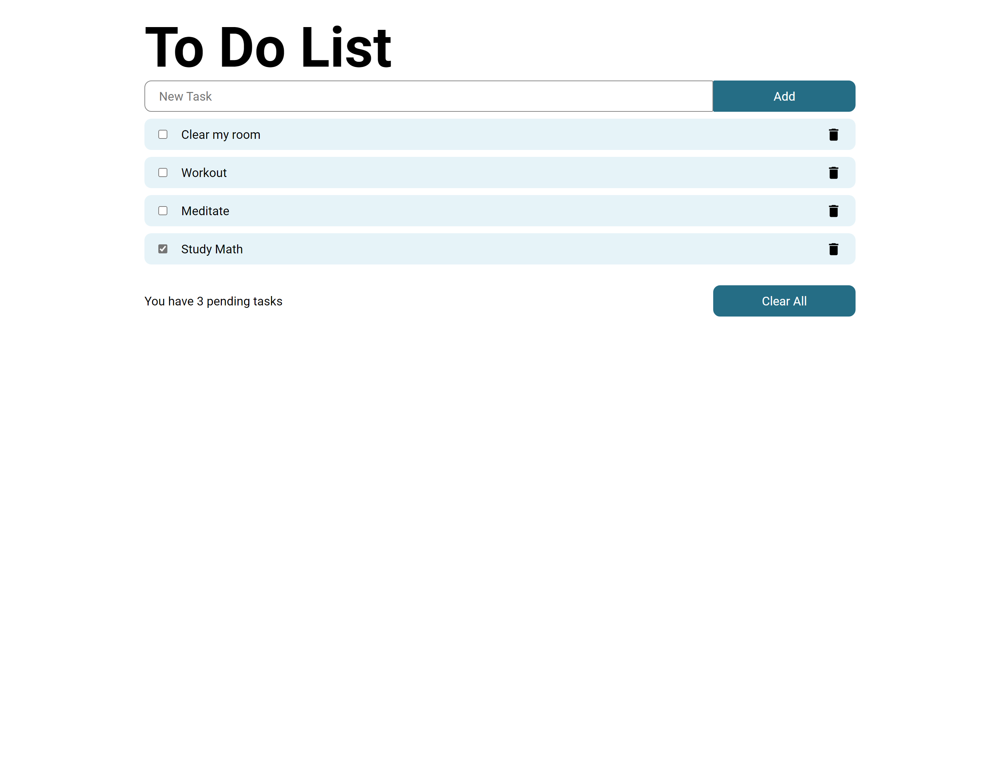

<h1 align="center">
  ToDo App
  <br>
</h1>

<h4 align="center">A minimal To Do List app built with <a href="https://reactjs.org/" target="_blank">React</a>.</h4>

<p align="center">
<a href="#how-to-use">How To Use</a> •
<a href="#credits">Credits</a> •
</p>



## How To Use

To clone and run this application, you'll need [Git](https://git-scm.com) and [Node.js](https://nodejs.org/en/download/) (which comes with [npm](http://npmjs.com)) installed on your computer. From your command line:

```bash
# Clone this repository
$ git clone https://github.com/amitmerchant1990/electron-markdownify

# Go into the repository
$ cd electron-markdownify

# Install dependencies
$ npm install

# Run the app
$ npm start
```

> **Note**
> If you're using Linux Bash for Windows, [see this guide](https://www.howtogeek.com/261575/how-to-run-graphical-linux-desktop-applications-from-windows-10s-bash-shell/) or use `node` from the command prompt.

## Built wit

This software was built with:

- [Reactjs](https://www.reactjs.org)
- [Node.js](https://nodejs.org/)
